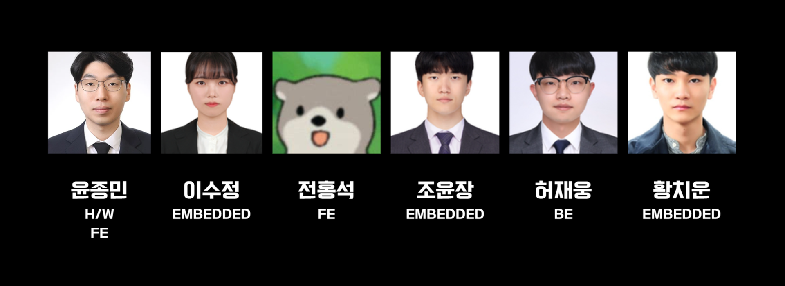
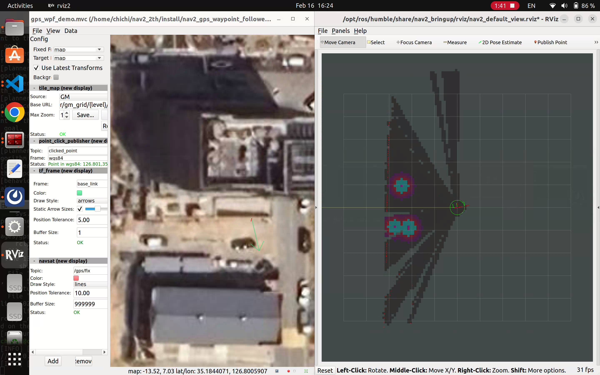
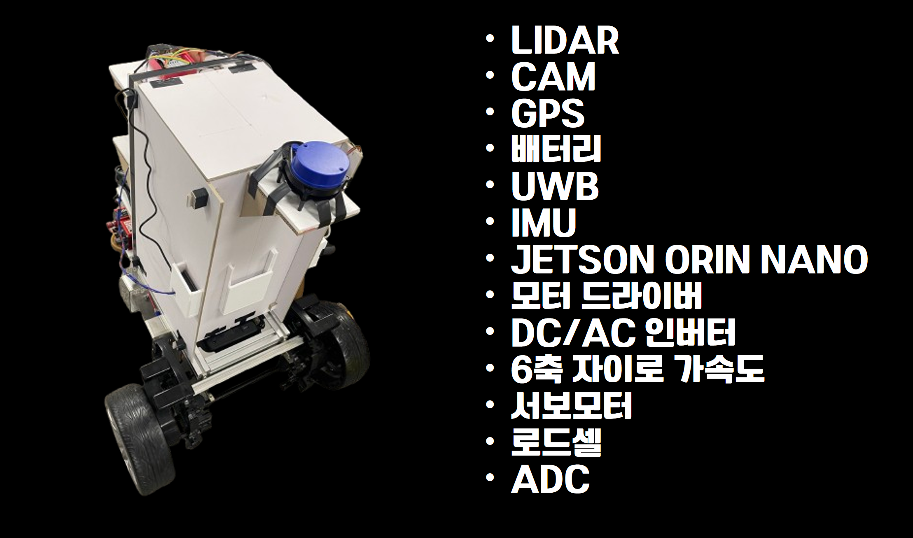

# 😁AI 개인 운반 로봇

## 😊프로젝트 소개
본 프로젝트는 **실외 자율주행**을 수행하고, Tag를 가진 **사용자를 Following**하여 물건을 스스로 운반합니다. 또한 개인사용에 특화되어 로봇을 손쉽게 사용자가 동작시킬 수 있도록 플랫폼(App)을 제공합니다.
### 👌프로젝트 기간
2025.01.13 ~ 2025.02.21 (6주)
### 😎협업 링크
[캐로봇 노션 링크](https://www.notion.so/1736458fd4ee80b797bbe5ef825752a3)
### 🙌Hard Carry PJT 팀원

- 윤종민
- 이수정
- 전홍석
- 조윤장
- [허재웅](https://github.com/wkdgjwodnd)
- [황치운](https://github.com/HwangCU)

### 📖명세서
[기능 명세서](https://docs.google.com/spreadsheets/d/1jOaaYXQAYIGyNFBkYT3Phov0yCPjWvQRRFKNf4ej_8A/edit?gid=0#gid=0)\
[Wire Frame](https://www.figma.com/design/N0g7xVEB5lCZSohKOAqKcQ/Untitled?node-id=0-1&p=f&t=V7wDdMtlvKyDEZxP-0)\
[API 명세서](https://www.notion.so/API-b987654080bd45f48ca3ab7ff2a2a964)\
[ERD](https://www.erdcloud.com/d/p7Crd4Q4dCNJWHAp2)\
[Sequence Diagram](https://viewer.diagrams.net/?tags=%7B%7D&lightbox=1&highlight=0000ff&edit=_blank&layers=1&nav=1&title=sequence%20dia.drawio#R%3Cmxfile%3E%3Cdiagram%20name%3D%22Page-1%22%20id%3D%2213e1069c-82ec-6db2-03f1-153e76fe0fe0%22%3E7V1bc6O4Ev41VO0%2BjEvozqPJbR4mNanNXmYfiU1izmDjwiSZnIfz24%2FEzUjCGGOwncRJVQICJFvdX3frU0tY6GL%2B6yb2lrPbaOqHFgTTXxa6tCCEDFLxT5a8ZSU2cXBW8hQH07xsXXAf%2FNfPC0Fe%2BhxM%2FZVyYxJFYRIs1cJJtFj4k0Qp8%2BI4elVve4xCtdWl9%2BQbBfcTLzRL%2FwmmySwvtQFYX%2FjqB0%2BzvGlO8gsP3uTnUxw9L%2FL2FtHCz67MvaKa%2FNbVzJtGr5UidGWhiziKkuxo%2FuvCD2W%2FFj2WPXe94Wr5kWN%2FkbR54PtXZv8I2B39z%2Bz2Znp%2F795%2Bvf%2BS1%2FLihc95V3x%2FXfixKLKuLqwxsBxiXbmWiywX54UutBwuC8fUGl%2Fk3y15K7rSX0zHUiLiLO0M5M6SeSjObHGY9pQvPxAQZ4%2FRIsl1gYnTFz9OAiGTcRg8LUTZQ5Qk0VxcWCVenBSVTkJvtQomRfF1EBaVi5bzM1n51FvN0pbkpexT%2BlNDC9adZ5ciEWruR3M%2Fid%2FELbmOfwEjAAnPHntdq0ihB7OKchRlsR96SfCiNunlmvpUNlG2ehcF4sOUTdpMtAkAwphDRjgFJKuhxBgeMafyQ9QGVtFzPPHzOqtqoTWDGBlRB5Q%2F9k6tCBE8%2BUlDK8WN0ePjylfuEQeVnl4XpWq7gwpDQ4Vv7u5FgeuthPwhuAmjB0%2FWcicRmSu20OcL6%2BrScqjFHUOHKxq7USlNPQ%2B9Bz90S4NwEYVRvL4qlf3amweh7Nm%2F%2FXjqLTwTA1JF7%2FMP4ocP0evVusBNC8SF4jP1Ag3%2FV5D8kMcjgPPTf%2BV9I0Ly08tf%2BXPpyVvl5M6PAyE%2BP87L2sJMdHaqnU1S5Y14FNBgFCuqWtiyPWHHC5ufV4so6AYsh%2FMRWeMKQK1ae2TT9Q%2FDrYAlRO29VW5byhtWx4IeMqB37y9WkXQff6dlEIiCaZOP0HS2o%2Buo6jtQ9D3TfvE1f2RKXZxmOo4xLgrWWp6evVXPdD1fY8YGRAENRfSEUfMl9ShcUcSD%2BjQmfFpV66mKia4%2BzHFAc0Un4KawgRXXn3kvQYqWP2PfT13T2HK55YI05gIyzoLgWzRpdl%2B%2FpVGZCMYc%2BRi%2FtvhFep%2B4PJbH8gCLB35vEatt8CddcGj6nd5xuMmRaZjk%2FIQxKSCJVBgcFpHUEa7UxmJIk%2F5lykfBdmdEbqnoBBBJDETmsHNT8HCcAzEf56TIc64klkShc91D4PgQRpOfR4ocC7gInyCUSQEMgHhnwJTYFvADVEU3BLwLuttjMFOmJuOLtvpF23H6ARRHI6YN1TAbkeogqhumiAP1at9hzEgN1N1EXvhbBXrCh7kp4krQjSX7ULjE39dQ5Ck5MQbWmLxnKPao6Oxgem4Lx8EdtP5Vw0qEtAFNaz5Cj%2BX0inbW8vp2IKtvZ63uWY0HBwgzAHLvxy%2BSk9M0fDXzlvLweR5%2BCx79MEhVdFmxomFeXLGs7ussSPz7pZfGLK%2Bxt1TDu4lQZS9YpI9n52HoLVfBQ9qqNMuxP3mOV0Jx%2FvBXmc7L0ug5kS1dlAQtUGJFWVVJgIK03rmMLNPjZsytkjj6WdKydisU2kLqrpfDfSJQlH71vGMF8PxfViPSNiKIIKRoTaFElWCtJI2r0RolGotQBZiiQbuqCzfU5dJ%2FCSb%2BWV1OQF0Yck5MXRwz6G3wnLkRFcXEtcilpi9RnMyip2jhhVWNUQeI70OKm5G1UbRYjfFKw6CI1pSsM5Rgi8Yqkv1r5cemeM924PB2wLa1aOP4hsA2p%2F7OlqARW21NAaKwlSnQJxb6Ey00RJvP6p5NwfFNATw5S2BO45wtQSO0WlsCyFpZAhujoWRrTjv88f3%2BbAhOwBA4mrKcgCGoYcTPhqAJWG0NQenrtxgCCAaTrcm7fv%2FzzirzvDiWB5xaY9uQ%2BYGn69VZvWJeIZ2nsJR5BepYx51WyADTRLciu8BQQdqbseGwOWRK65h2nc%2BDekWaop7AfJ5tMqcWpN5cuqXFw0r%2BS6cLxulMeab1dnrALA5SKGTT5ykUXCBvk187ryL7a9VNSaRT7MQac6ucmhgXk%2Fm8WkjSmp1sYj9%2FysVFqmVlvsPBearl%2BLIJjgedtU9nD7AKQZsfe2rP3pq4iWymTkbbpjEeFIOqL8B6sNcWgzagoLmmUwChyUd%2FX4oOHQschYm07sGLOHySh5ciohS%2B9624JBqsXG0KUq9jb%2B5vj0DTCMWPr178LFDRdN9uCB36CPBUadkQmzEArIvwcJFP338UYNK%2FG6VzLcL16DVYPJ2ieIo%2BpPKZsu%2FSLKL%2BJUcYNSTHnLpxHMEDCa5wvxXBfYui5QGEADYL4VE4iSI0tyB6JPK3jM8rV%2FJcv6yiSnn2UxEnVsQJQT%2FiZFrwgpgZhKHaodZQ0TisIV%2FXuX%2FFQRYNcJSGKZfyoAwRtkTs7yj5odM6jTZxQTNTI%2BICAgpc7%2BnhCdf0q3CCO3t4hkfc3rjkQwQyI04hoNyhhNiFFvecGEH0xIj82xw9MaIYSTXRE7VD1Y1xsDK4NEJbUo4%2FhwhtTc08UDhKnVE1A5uqCQ3UJiNIO%2BovYWTEiZHo1lT1BqXtTWdMbrsS14BiPJiuZ3NQ%2ByGYEO83aSxV7TL4pY3GN5aEp7dmQk0urZ213egd85WSeRNWuQpxK7EFm%2B2mGANiR1WZYhnInopZTlsV1WpUxYCGxSTJezQscvynGBZE6JCGpUVKOmvpQzelrh%2FGUuluFXItHGtrlhjV2FgORxxXljy2y03vTd3qEs8NSqnBOMn0WLx59eJHNk7NrPuQxqm%2B2gMYJ5O439c45Zn%2F%2BSqcMu3fpkOuXeuaunwokk5b98zYqLIoGmgVtk5m5s4IVSwNQForfESqlw8cHNUQ5jsZok8cJdEjGSItXD9gkGQSu4bAP%2BHk8Bbmiatr1G3cbh4YDzYPDGsSgCWAiUS1JJagXFWzxnz7mbL9KKj3tofCerUpJEhxow78nBsnMEZHWk603TFgd5x0ofqGrRNEtR9g6wST0D%2Bb062rb5i6yIxw0sqc6qRTb9YUtUii3oM5KAnIIt%2BlTIDptluFtsMLtodbGH880oCPqhG1GtZTyEYYavaiNY3A0ch2jPoUJqGVJerNhkBD%2B1qRm5%2BXP0DN9mVA%2FuBY9AFqkdx9MhZKBE8caSYKDWaiWgRTzjFNGdMShyhyRoTtvY2ADK50M4ZFT8OjmTGTfv%2FrH5loV%2Bwh1SZF9QPbrOa9Kz6izTrnoXfIWdKSlmhdulmdsRoqZQntRlxvSyEfwO3sOfAHDCq%2BigHn7KsK7aNUjNH35s%2FrfBVtt%2BtNb8bIJMmLLXIrwfYnckfHYr6P545qmG%2Fi%2Fk9ubEkuDdGLjk52lPo8mE5TcnK71L3nJMqXytmWnmlZsKSVtMwKcdpGK3bJqVRJOVQMJCv2BtfYGzgUsY1qiO1z0LBNikwzrqTdLhaoAb17SRG3oEW7D1cB1FJxCO0UOLT12kfzxtq0E8VdKS%2FG9c3sKENirAhb%2BeBdU08ZAbWfe%2BPH0%2B9nSNPASqpqbxu51uVut9qAtVdfUZfW37jKqw9zYWv9XWMuYI1a25qv7s9cmAzoxvUsrpckh15s1EOf20jtc1jE0lVHy%2BsmPchQnX7eL2L%2Fqau2mQBoqHgJm6ybENDFsxzYuJ5VWfiawwUkMxGfzj5xzGtzdQhSB8U6JA4W82KTKLsVZkm%2BPEf8uf82vhX%2Fbsd3v92I4qUYqJpbgL%2BjlUKVWYKSacnCOIiOOktAmnddBSPs4H42XaVawINQx5UaDneaK3oXSRS4Z4qxx8TYTtxie518X9m0JROw%2B2bAtLmigck%2FXJch27xH%2FFgmw7qX6QGS01Z5qixJRwLpnTUjgQ9MGOKjEYbqrg%2BHS5XF51TZ%2FakoAloGyINRUfWZsrvt%2FHJy1FUt3N8Pk4VZR09Sw2RhxzkYk1V87rZMFs6zOwZlsshuZOu28KnbdGpVxx1Nxx3OhqRnT34FpM3U8Iegjtt3UY24MyoaOI4iGzjT%2FVcd1AZXIE8U4hfKKiXups2N5bPSrtS9ClJetWte%2FPN5849I8%2BbHHzB%2BIyarfOklkhOT7xQ1ZH%2FePPXw0SKCqmU8%2Fuap5MyKt948NQPYRuGe2n7qpIYqP4u2D9HydmO8wQh0YhLoW99%2F3mWz3L1fgd42pN3Y8cd4gbl8Q9jm3azszqQgI8qLle3mak9gU0xSw1OfXzWJOr5qcqgd47aYrj5fnmfMBlPUEQv6JqMt92U%2BrXkcUrdz89nB7pZRgFom%2FHcIk8RpHEVJVehiwDK7jaZywHv1fw%3D%3D%3C%2Fdiagram%3E%3C%2Fmxfile%3E#%7B%22pageId%22%3A%2213e1069c-82ec-6db2-03f1-153e76fe0fe0%22%7D)

## 🤖캐로봇(Carrobot)

### 🧑‍💻기술 스택
### Robot 
 

 

### Frontend

### Backend

### 🥏아키텍쳐
<figure>
    
</figure>

### 🈴전체외관
<figure>
    
</figure>

## 💫주요기능
 해당 프로젝트는 **조종모드**, **팔로잉모드**, **배달모드** 기능을 제공합니다. **조종모드**는 사용자가 로봇을 직접 컨트롤할 수 있습니다. **팔로잉모드**는 UWB센서를 소지한 사용자를 로봇이 팔로잉 합니다. 마지막으로 **배달모드**는 자율주행을 통해 목적지에 도달하여 물건을 전달합니다.\
 부가적으로 **무게측정**, **수평유지** 등의 기능을 제공합니다.\
 사용자가 사용할 수 있는 **Application**을 구현하여, UI를 통해 기능전환, 로봇의 정보, live카메라 등의 기능을 경험할 수 있습니다.
### 🕹️조이콘(조종) 모드
조이콘만 있다면, 캐로봇을 원하는대로 간단히 조작할 수 있습니다.

### 🐕팔로잉 모드
UWB만 있다면, 캐로봇이 어디든 따라갑니다. 로봇의 2개, 사용자의 1개의 UWB센서를 활용해 사용자의 거리, 각도를 계산합니다. 거리와 각도를 활용해 사용자의 정확한 위치를 알아내고 Following기능을 구현합니다.
<figure>
    
</figure>

### 🚛배달 모드
경로를 지정해주면, 캐로봇이 자율주행을 기반으로 배달을 시작합니다. **GPS, IMU, Lidar** 센서를 Fusion하여 로봇이 자신의 위치를 추정(**SLAM**)하고 주변의 사물을 인식합니다. \
**Navigation2**와 같은 판단 알고리즘을 통해 경로를 생성하고 주행합니다.

<figure>
    
    <figcaption>GPS값을 받아와서 Mapviz띄운 화면</figcaption>
</figure>

<figure>
    
    <figcaption>GPS+IMU+Lidar 센서를 통합한 Mapviz(좌) rviz2(우) </figcaption>
</figure>

### 📹UCC
전반적인 기능이 부각된 짧은 영상
[YouTube Link](https://youtu.be/uDIG6P6mnm4)

## 💫추가 기능

### 무게 측정

<figure>
    
    <figcaption>로봇의 보관함 안의 무게를 App에 업데이트 </figcaption>
</figure>

### 수평 유지
<figure>
    
</figure>

<figure>
    
    <figcaption>보관함 내부의 수평을 유지하는 장치</figcaption>
</figure>

### live카메라 및 객체인식(YOLOv5)
<figure>
    
</figure>

### Application UI
<figure>
    
    <figcaption>배달 모드(좌) 팔로잉 모드(우) </figcaption>
</figure>

### 캐로봇 하드웨어
<figure>
    
</figure>

## 🎥상세설명 및 시연영상
[캐로봇 상세설명 영상](https://youtu.be/c5M3H99YP9Y)
