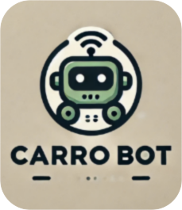
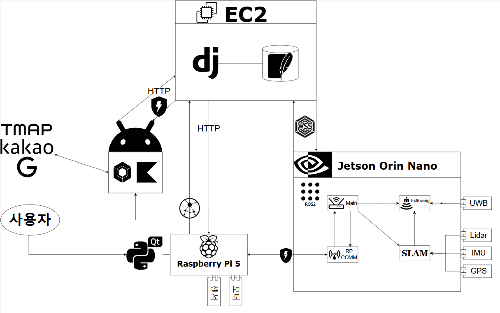

# AI 개인 운반 로봇

## 프로젝트 소개
본 프로젝트는 **실외 자율주행**을 수행하고, Tag를 가진 **사용자를 Following**하여 물건을 스스로 운반합니다. 또한 개인사용에 특화되어 로봇을 손쉽게 사용자가 동작시킬 수 있도록 플랫폼(App)을 제공합니다.
### 프로젝트 기간
2025.01.13 ~ 2025.02.21 (6주)
### C103 Hard Carry Team Members
- 윤종민
- 이수정
- 전홍석
- 조윤장
- 허재웅
- 황치운
  
### 캐로봇(Carrobot)

## 주요기능

### 조이콘 모드
조이콘만 있다면, 캐로봇을 원하는대로 간단히 조작할 수 있습니다.

### 팔로잉모드
UWB만 있다면, 캐로봇이 어디든 따라갑니다.
  

### 배달모드
경로를 지정해주면, 캐로봇이 자율주행을 기반으로 배달을 시작합니다.

## 추가 기능

### 무게 측정

### 수평 유지

### 앱 화면

### 디스플레이 화면

### 캐로봇 하드웨어
- 카메라
- 배터리
- DC/AC 인버터
- Jetson orin nano
- 모터 드라이버
- ADC
- LIDAR
- GPS
- UWB
- IMU
- 6축 자이로 가속도
- 서보모터
- 로드셀
- ADC
